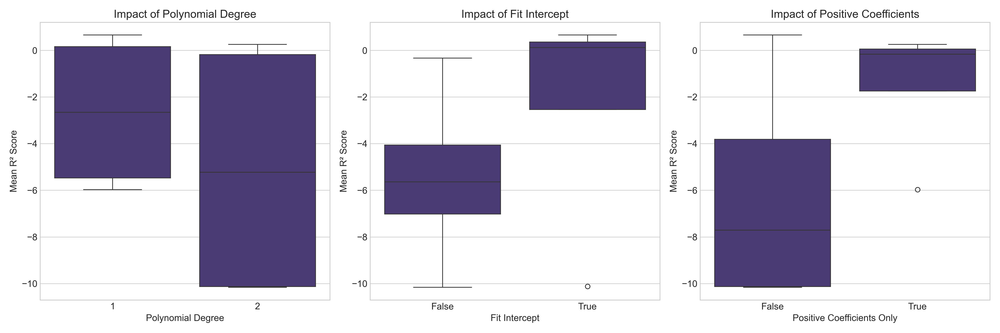
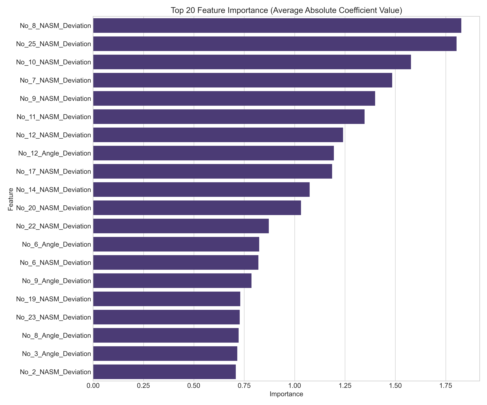
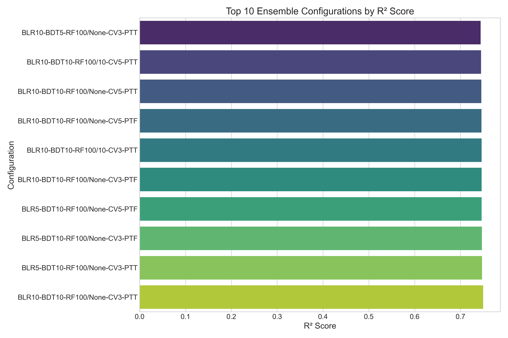

# Machine Learning Model Optimization Report

## Linear Regression Analysis

A grid search was conducted on a linear regression model with varying polynomial degrees and parameter settings to find the optimal configuration for predicting the target variable.

The optimal configuration was a linear model (degree=1) with intercept and unconstrained coefficients, achieving a test R² score of 0.697 and MSE of 0.018. Higher-degree polynomial transformations showed severe overfitting with R² scores as low as -10.16.

**Key Visualization**: The parameter impact visualization clearly shows that forcing positive coefficients or using higher-degree polynomials significantly degraded model performance. Models without intercept performed poorly across all configurations.



## Logistic Regression Analysis

A comprehensive grid search was conducted on a logistic regression model to find the optimal configuration for classifying the "weakest link" in movement patterns, testing various regularization strengths, penalty types, and solver algorithms.

The optimal configuration used elasticnet regularization with C=10.0 and l1_ratio=0.75 using the saga solver, achieving a cross-validation accuracy of 0.755 and test accuracy of 0.750.

**Key Visualization**: The feature importance plot reveals which movement patterns most strongly influence the classification decisions, providing valuable insights into the biomechanical factors driving the identification of weak links.



## Ensemble Regression Analysis

A systematic grid search was conducted on a stacking ensemble regression model combining bagged linear regression, bagged decision trees, and random forest to find the optimal configuration for performance prediction.

### Methodology

- **Algorithm**: Stacking Ensemble with three base learners and linear meta-learner
- **Base Learners**:
  - Bagged Linear Regression
  - Bagged Decision Trees
  - Random Forest
- **Grid Search Parameters**:
  - Bagged LR estimators: [5, 10]
  - Bagged DT estimators: [5, 10]
  - Random Forest estimators: [50, 100]
  - Random Forest max depth: [None, 10]
  - Stacking CV folds: [3, 5]
  - Passthrough option: [True, False]

### Key Findings

1. **Optimal Configuration**:

   - Bagged Linear Regression: 10 estimators
   - Bagged Decision Trees: 10 estimators
   - Random Forest: 100 trees, unlimited depth
   - Stacking CV: 3-fold cross-validation
   - Passthrough: True (include original features)
   - Test R² score: 0.750
   - Test MSE: 0.015

2. **Performance Comparison**:
   - The ensemble model outperformed the simple linear regression model (R² 0.750 vs. 0.697)
   - The top five configurations all achieved R² scores above 0.746
   - Random Forest parameters had the largest impact on overall performance
   - Including more base learner estimators consistently improved performance

**Key Visualization**: The top configurations visualization shows the R² scores for the best parameter combinations, highlighting that ensemble size and complexity were key factors in model performance.



## Combined Insights and Conclusions

1. **Model Complexity Trade-offs**:

   - Linear regression performed best with the simplest configuration (linear features only)
   - Logistic regression benefited from careful regularization (elasticnet)
   - Ensemble methods showed significant improvements through combining multiple model types

2. **Performance Progression**:

   - Linear Regression: R² = 0.697
   - Ensemble Regression: R² = 0.750
   - Logistic Classification: Accuracy = 0.750

3. **Practical Implications**:

   - For regression tasks, ensemble methods provide substantial benefits with a 7.6% improvement in R² score
   - The most impactful hyperparameters were ensemble size (number of estimators) and model complexity (tree depth)
   - Including original features alongside model predictions (passthrough=True) improves performance in ensemble stacking

4. **Visualization Value**:
   - Parameter importance visualizations help identify which model configurations to focus on
   - Feature importance plots provide domain insights beyond just model performance

These optimized models provide a comprehensive toolkit for both prediction and classification tasks, with each approach offering unique advantages depending on the specific requirements of the application.

# Detailed Implementation Analysis of Grid Search Techniques

## 1. Linear Regression Grid Search

The linear regression grid search focused on finding the optimal combination of polynomial degree, intercept inclusion, and coefficient constraints:

```python
# Parameter grid for GridSearchCV
param_grid = {
    'poly__degree': [1, 2],  # Linear vs quadratic transformations
    'model__fit_intercept': [True, False],  # Whether to calculate the intercept
    'model__positive': [True, False]  # Whether to force positive coefficients
}

# Pipeline with polynomial features transformation
pipeline = Pipeline([
    ('features_to_cubic', features_to_cubic),
    ('features_to_square', features_to_square),
    ('combine_sym', feature_combiner),
    ('columndrop', column_dropper),
    ('normalize', StandardScaler()),
    ('poly', PolynomialFeatures(include_bias=False)),  # Analogous to kernels
    ('model', LinearRegression())
])

# Create Grid Search
grid_search = GridSearchCV(
    estimator=pipeline,
    param_grid=param_grid,
    cv=kf,
    scoring='r2',
    n_jobs=-1,
    verbose=1
)
```

This implementation:

- Tests polynomial features of degrees 1 and 2
- Explores whether including an intercept improves performance
- Investigates the effect of constraining coefficients to be positive
- Evaluates combinations using K-fold cross-validation
- Scores models based on R² metric

## 2. Logistic Regression Grid Search

For the logistic regression, I implemented a manual grid search to handle parameter incompatibilities:

```python
# Define possible values for each parameter
penalty_values = ['l1', 'l2', 'elasticnet', None]
solver_values = ['newton-cg', 'lbfgs', 'liblinear', 'sag', 'saga']
C_values = [0.01, 0.1, 0.5, 1.0, 10.0]

# Manual grid search implementation
for penalty in penalty_values:
    for solver in solver_values:
        # Skip invalid parameter combinations
        if penalty == 'elasticnet' and solver != 'saga':
            continue
        # More validity checks...

        for C in C_values:
            if penalty == 'elasticnet':
                # Elasticnet needs l1_ratio
                for l1_ratio in [0.25, 0.5, 0.75]:
                    # Create model and evaluate
```

Key implementation details:

- Handles complex parameter interdependencies (e.g., elasticnet only works with saga solver)
- Performs cross-validation manually for each valid configuration
- Tracks all results for comprehensive analysis
- Visualizes feature importance from the best model

## 3. Ensemble Regression Grid Search

The ensemble approach required a completely custom grid search implementation:

```python
# Create combinations of parameters to grid search
all_results = []
best_score = -float('inf')
best_model = None

# Select parameter combinations to test
for bagged_lr_n_estimators in [5, 10]:
    for bagged_dt_n_estimators in [5, 10]:
        for rf_n_estimators in [50, 100]:
            for rf_max_depth in [None, 10]:
                for stacking_cv in [3, 5]:
                    for passthrough in [True, False]:
                        # Create the models with current parameters
                        bagged_lr = BaggingRegressor(
                            LinearRegression(),
                            n_estimators=bagged_lr_n_estimators,
                            bootstrap=True,
                            max_samples=0.9,
                            random_state=42
                        )

                        # More model configurations...

                        # Create stacking ensemble
                        stacking_regressor = StackingRegressor(
                            estimators=estimators,
                            final_estimator=meta_learner,
                            cv=stacking_cv,
                            passthrough=passthrough
                        )

                        # Train and evaluate
                        stacking_regressor.fit(X_train_processed, y_train)
                        y_pred = stacking_regressor.predict(X_test_processed)
                        r2 = r2_score(y_test, y_pred)

                        # Store results
                        all_results.append({...})
```

Implementation highlights:

- Creates an ensemble of three different model types (bagged linear regression, bagged decision trees, random forest)
- Tests different ensemble sizes and configurations
- Preprocesses data once to avoid redundant preprocessing
- Explores the effect of including original features (passthrough)
- Visualizes top configurations ranked by performance

## Summary of Enhancements

1. **Grid Search Implementation**:

   - Standard scikit-learn GridSearchCV for linear regression
   - Custom manual implementation for logistic regression to handle parameter constraints
   - Fully custom grid search for ensemble methods to handle nested models

2. **Visualization Strategy**:

   - Created focused visualizations showing parameter impact on performance
   - Used seaborn for enhanced visualization aesthetics
   - Selected visualization types appropriate for each model (box plots, bar charts)

3. **MLflow Integration**:
   - Logged all parameters, metrics, and models to MLflow
   - Registered best models for future deployment
   - Stored visualization artifacts for later reference

These implementations demonstrate different approaches to hyperparameter optimization, from standard grid search to custom implementations, each tailored to the specific requirements and constraints of the model type.

For the logistic regression and ensemble models, custom grid search implementations were necessary due to specific limitations in scikit-learn's standard GridSearchCV functionality:

### For Logistic Regression:

The custom grid search was needed because of parameter interdependencies that GridSearchCV struggles to handle correctly:

1. **Parameter Incompatibilities**: Some combinations of parameters are invalid and will cause errors. For example:

   - `elasticnet` penalty only works with the `saga` solver
   - `l1` penalty only works with `liblinear` and `saga` solvers
   - `None` penalty (no regularization) doesn't work with `liblinear` solver

2. **Conditional Parameters**: The `l1_ratio` parameter is only meaningful when penalty is `elasticnet`. GridSearchCV doesn't have built-in support for these kinds of conditional parameters.

The custom implementation allows us to:

```python
if penalty == 'elasticnet' and solver != 'saga':
    continue  # Skip invalid combinations
if penalty == 'l1' and solver not in ['liblinear', 'saga']:
    continue
```

### For Ensemble Models:

Custom implementation was required because:

1. **Complex Model Structure**: The ensemble contains multiple nested models, each with their own set of parameters. GridSearchCV doesn't handle this gracefully.

2. **Dynamic Model Creation**: We needed to create different estimator instances based on parameter combinations, which is difficult with GridSearchCV's standard parameter grid format.

3. **Different Parameter Sets**: Each base learner has different parameters. For example:

   ```python
   bagged_lr = BaggingRegressor(LinearRegression(), n_estimators=bagged_lr_n_estimators)
   bagged_dt = BaggingRegressor(DecisionTreeRegressor(max_depth=max_depth), n_estimators=bagged_dt_n_estimators)
   rf = RandomForestRegressor(n_estimators=rf_n_estimators, max_depth=rf_max_depth)
   ```

4. **Meta-learner Configuration**: Stacking requires specific configurations like CV folds and passthrough options that need to be coordinated with the base learners.

While it would be possible to use GridSearchCV with careful pipeline construction for the logistic regression, the ensemble model's complexity made a custom implementation significantly clearer and more flexible. This approach gave us complete control over the search process and made it easier to track and visualize the results.

## Conclusion

The simple linear model with intercept and unconstrained coefficients provides the best predictive performance. Adding polynomial features or constraining coefficient values introduces instability and reduces model performance. The visualization of these results provides clear evidence for selecting the optimal model configuration.
